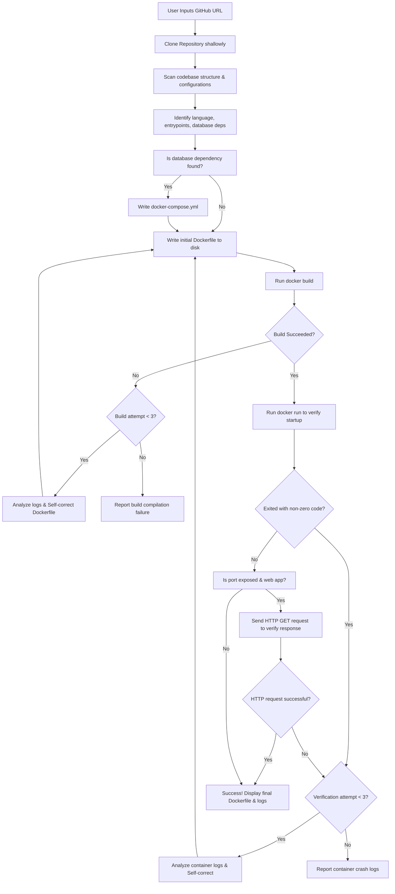

# DockerForge — AI-Powered Dockerfile Generator & Verifier

DockerForge is an autonomous, self-correcting AI agent designed to scan any codebase repository, generate a production-grade, optimized `Dockerfile` (and optionally `docker-compose.yml`), and verify the build's correctness by compiling and running the container locally.

If the container build or verification fails, the agent intercepts the build logs or runtime exit codes, analyzes the failure, self-corrects the Dockerfile, and retries the process autonomously (up to 3 times).

---

## 🏗️ Architecture & Decision Flow

Below is the detailed agent execution loop, representing how DockerForge analyzes, builds, validates, and self-corrects:



---

## 🛠️ Tech Stack & Dependencies

- **Core**: Python 3.12
- **Agent Orchestration**: LangChain & LangGraph (custom compilation)
- **UI & Presentation**: Rich (for premium styling, layouts, and panels)
- **Container Control**: Docker SDK for Python (interacting with local Docker socket)
- **Package Manager**: `uv` (fast dependency sync)

---

## 🚀 Setup & Installation

You can run DockerForge either **locally** or **fully containerized** inside Docker (Docker-in-Docker).

### Prerequisites
- Docker installed and running on your host machine.
- Python 3.12+ (if running locally).
- OpenRouter API Key (to invoke the DeepSeek model).

### 1. Configuration
Create a `.env` file in the root directory:
```env
OPEN_ROUTER_API_KEY=your_open_router_api_key

# Optional: LangSmith Tracing
LANGCHAIN_TRACING_V2=true
LANGCHAIN_API_KEY=your_langchain_api_key
LANGCHAIN_PROJECT=dockerforge
```

### 2. Running Locally
Using `uv` for package management, install dependencies and run the program:
```bash
# Sync dependencies
make install

# Run the CLI tool
make run
```

### 3. Running Containerized (Docker-in-Docker)
DockerForge itself is containerized. It communicates with your host's Docker daemon via socket mount.

```bash
# Build the DockerForge image
make docker-build

# Run DockerForge inside a container (automatically persists results on host)
make docker-run
```
*Note: The containerized command mounts `$(shell pwd)/.tmp_repos` so that any generated Dockerfiles are immediately saved back to your host machine's directory.*

---

## 🧠 LLM Provider Choice & Rationale

- **Provider**: **OpenRouter**
  - *Why*: OpenRouter provides a unified API gateway that allows us to seamlessly switch models without changes to our network code. It also supports streaming chunk-by-chunk tool calls, which is crucial for our real-time Rich terminal UI.
- **Model**: **`deepseek/deepseek-v4-flash`**
  - *Why*: DeepSeek v4 Flash offers an exceptional balance of fast inference speed, low latency, and advanced coding logic. It features a huge context window, enabling the agent to read multiple codebase manifests and source files simultaneously. It is also extremely cost-efficient for agentic self-correction loops.

---

## ⚠️ Known Limitations & Edge Cases

1. **Interactive CLI Tools**:
   - If you run DockerForge on a repository that is itself an interactive CLI tool (such as DockerForge itself), the containerized verification run (`docker run`) will exit with status `1` because `stdin` is not attached during verification.
   - *Mitigation*: The agent handles this by detecting that no ports are exposed and determining if the app is a CLI tool, avoiding false-positive validation crashes.
2. **Double Quotes in `.env`**:
   - Docker's `--env-file` parameter does not strip quotes from variables. If you configure `API_KEY="value"`, the quotes are preserved inside the container.
   - *Mitigation*: Ensure all key-value pairs in `.env` are set without quotes (e.g., `KEY=value`).
3. **Lockfile Token Consumption**:
   - Lockfiles like `uv.lock` or `package-lock.json` are often larger than 400KB and contain long lists of transitive dependencies. Reading them directly exhausts the LLM's context token limits.
   - *Mitigation*: The tool layer intercepts lockfile read requests and returns a compact placeholder. This teaches the agent that the lockfile exists (so it can write cache-optimized `COPY` commands) but prevents it from reading the redundant body text.
